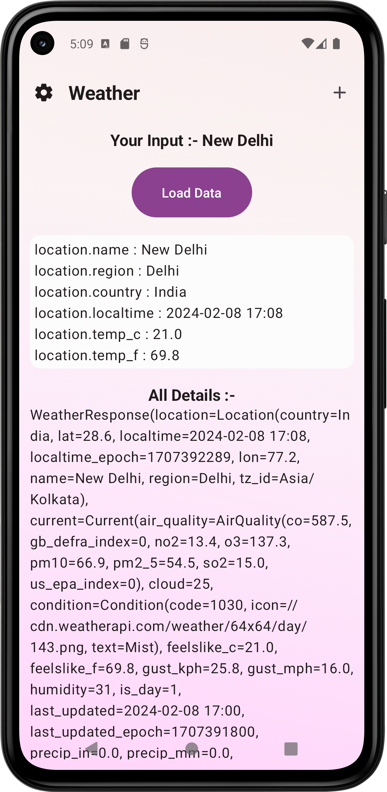
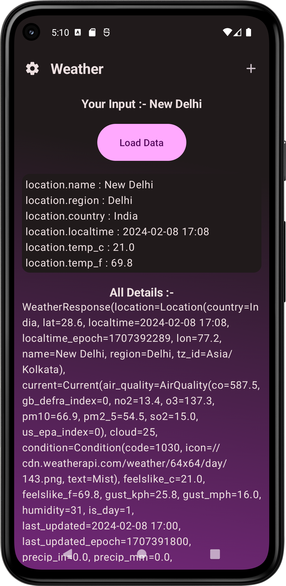

<!-- MARKDOWN LINKS -->
<!-- https://www.markdownguide.org/basic-syntax/#reference-style-links -->
[contributors-shield]: https://img.shields.io/github/contributors/damahecode/Weather.svg?style=for-the-badge
[contributors-url]: https://github.com/damahecode/Weather/graphs/contributors
[forks-shield]: https://img.shields.io/github/forks/damahecode/Weather.svg?style=for-the-badge
[forks-url]: https://github.com/damahecode/Weather/network/members
[stars-shield]: https://img.shields.io/github/stars/damahecode/Weather.svg?style=for-the-badge
[stars-url]: https://github.com/damahecode/Weather/stargazers
[issues-shield]: https://img.shields.io/github/issues/damahecode/Weather.svg?style=for-the-badge
[issues-url]: https://github.com/damahecode/Weather/issues
[license-shield]: https://img.shields.io/github/license/damahecode/Weather.svg?style=for-the-badge
[license-url]: https://github.com/damahecode/Weather/blob/master/LICENSE

[![Contributors][contributors-shield]][contributors-url]
[![Forks][forks-shield]][forks-url]
[![Stargazers][stars-shield]][stars-url]
[![Issues][issues-shield]][issues-url]
[![MIT License][license-shield]][license-url]

# Weather App by Damahe Code
A demo implementation of Weather API in Android App.

## Requirements
- Android Studio Flamingo or later

## Other Apps by Damahe Code
[Github](https://github.com/damahecode/Damahe-Code)

## Features
* Material Design 3 theme and components
* Material You dynamic color and Light/Dark theme support
* Integration with Architecture Components, ViewModel

```more features coming soon```

## Screenshots
|  |  |
|:---:|:---:|
| Main Screen Light | Main Screen Dark |
